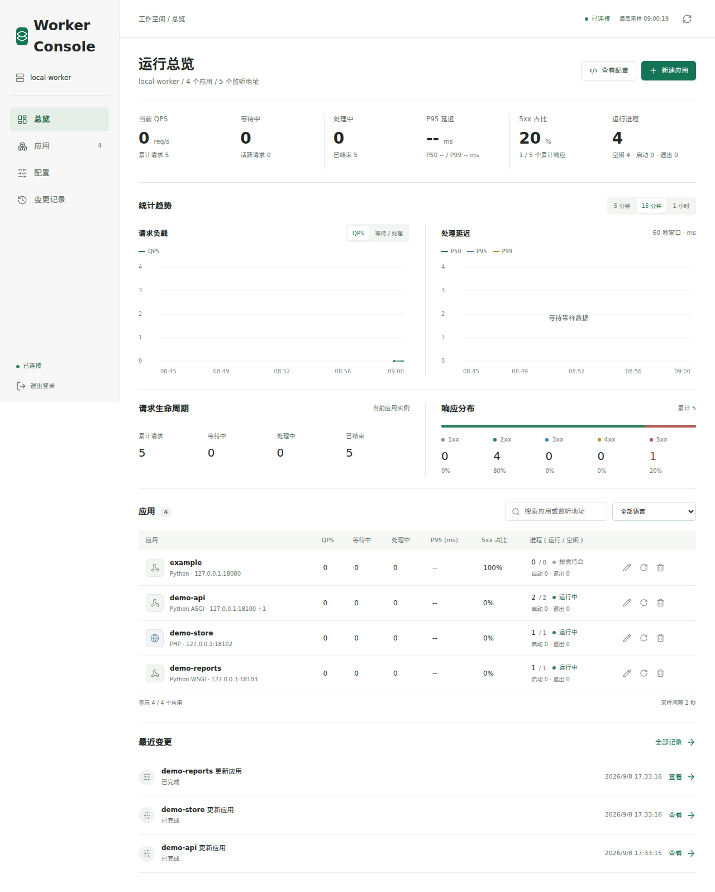
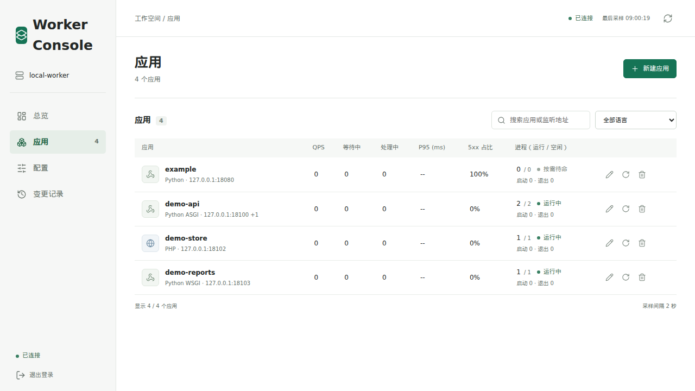
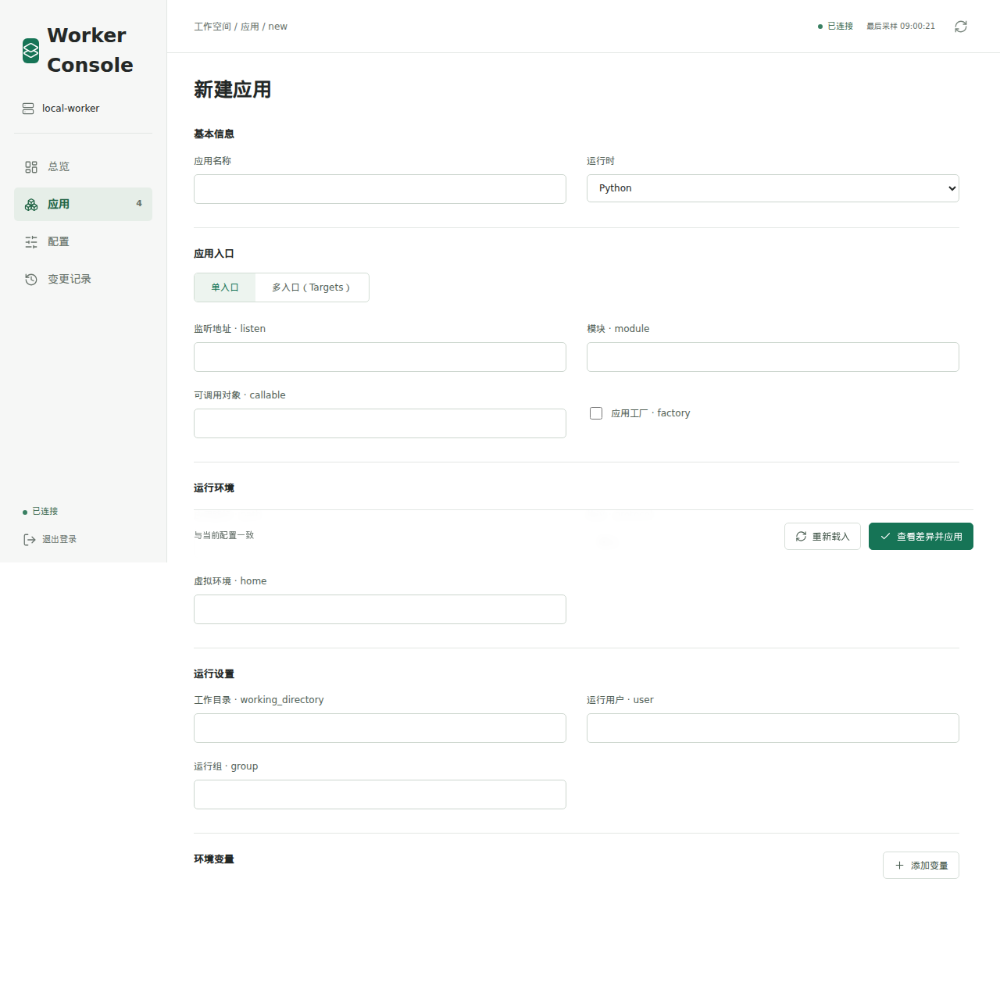
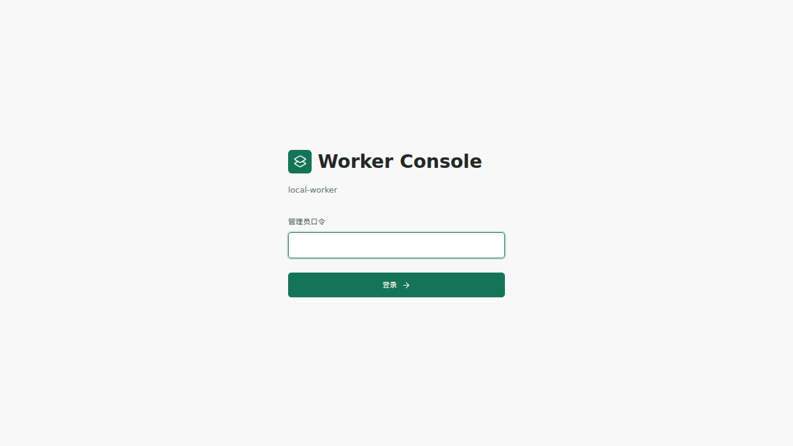

# Worker Dashboard

A lightweight web console for monitoring and managing an already-running
Worker instance. It serves a local static UI, samples runtime statistics, and
records configuration changes. The Worker process is managed separately; this
project connects to its existing Unix control socket and does not start Worker.

Python 3.10+ and the standard library are sufficient. There is no frontend
build, Node.js installation, or runtime package installation required.

## Features

- Overview metrics for traffic, processes, requests, responses, and latency.
- Per-application metrics, process controls, and configuration editors.
- Draft review with configuration differences before writes are applied.
- Auditable configuration history and validated restoration.
- Local-only default binding, authenticated writes, CSRF protection, and
  private state files.

## Product Preview

Worker Dashboard is designed to make Worker operations understandable at a
glance, from the first login to application configuration.

### Overview



### Application Management



### Create An Application



### Sign In



## Requirements

- Python 3.10 or newer.
- A running Worker instance with a JSON control API Unix socket.
- A Worker Dashboard user with permission to access that socket.

The dashboard follows the current Worker status schema. Keep the Dashboard and
Worker versions compatible; older or incomplete Worker fields are displayed as
unavailable where possible.

## Quick Start

Run these commands from the repository directory.

```sh
python3 server.py \
  --control /path/to/worker-state/control.sock \
  --state ./.state \
  --name production-01
```

Open `http://127.0.0.1:8090/`. On first start, an administrator password is
generated in `.state/admin-password`; read it with:

```sh
cat .state/admin-password
```

The password file and state directory are private and must not be committed or
served by a web server. Sessions expire after twelve hours and are invalidated
when the dashboard restarts.

If the Worker socket cannot be opened, check that Worker is running, the path
is correct, and the dashboard user has socket permission.

## Security And Remote Access

The service binds to loopback by default. Do not expose the built-in HTTP
server directly to the public internet. For remote deployments, terminate
HTTPS at a reverse proxy, restrict access with a VPN or firewall, retain the
original `Host`, and add each public hostname or IP with `--allow-host`.

For access through a reverse proxy, retain the original `Host` and add each
public hostname or IP with `--allow-host`. For example:

```sh
python3 server.py \
  --control /path/to/worker-state/control.sock \
  --state ./.state \
  --allow-host 192.168.31.128
```

```caddyfile
:80 {
    reverse_proxy 127.0.0.1:8090
}
```

The dashboard exposes only a fixed set of management operations; the raw Worker control API is not forwarded to the browser. Writes require a session, matching Origin, and the dashboard request header. Run the service as a user with permission to access the chosen control socket and private state directory. See [SECURITY.md](SECURITY.md) for the vulnerability reporting policy.

## Views

- Overview: global QPS, waiting and processing requests, P95 latency, cumulative
  5xx share, running processes, request lifecycle, response classes, and trends.
- Applications: comparable per-app QPS, waiting/processing counts, P95, 5xx share,
  and process state; individual latency, request, and process trends; application,
  process, target, and full JSON configuration editors.
- Configuration: common HTTP settings and complete JSON import/export.
- History: the last 100 dashboard operations, configuration differences, errors,
  and restoration of the configuration from before an operation.

For real local demonstration traffic, run `python3 demo/run.py start`.
It adds Python/PHP example apps, including two ASGI targets, and sends bounded
HTTP requests through Worker. See the [live demo guide](demo/README.md) for
the applications, traffic controls, and stopping the run.

The collector takes a sample every two seconds and retains up to one hour in
memory. Restarting the dashboard clears its metric history. Disconnections are
gaps; QPS is not calculated across a disconnect, a counter decrease, a changed
control socket, or an excessive sampling gap. Application configuration changes
also invalidate that app's rate, except for listener-only changes. The global
rate skips intervals in which an app is added, removed, replaced, or its counter
decreases. Rates for unaffected apps remain available. Worker does not expose a
runtime generation ID; a reset which reuses the socket, restores the same config,
and catches up with the old counter between samples cannot always be detected.

This dashboard uses the current status schema, with `processes`, `requests`,
`responses`, and `latency` both at the root and per application. Global values
come directly from Worker. Global latency percentiles are never averaged from
per-app percentiles. Request counters cover currently configured application
instances, not the lifetime of the Worker process. `waiting + processing` is
the active request count, and `idle` is a subset of `running`.

The 5xx share is the cumulative `5xx` count divided by the sum of all five
response classes, including 101 upgrades in `1xx`. Response totals are not
inferred from completed requests. No responses means an unavailable percentage,
not zero. Missing/null latency remains unavailable; a measured zero remains zero.
Latency trends plot Worker's rolling 60-second percentiles at each sample time;
the chart time selector changes the displayed history, not that rolling window.
Missing fields from older Workers are shown as unavailable.

A zero-process application with
`processes.spare: 0` is shown as waiting on demand; process state is not an
application health check.

## Configuration Behavior

Python and PHP application forms offer single-entry and multi-entry (Targets)
modes both when creating and editing an application. Switching modes retains
draft values. When converting several targets to one entry, choose the target
to retain; the configuration differences show the other listeners being removed
before submission. Shared application settings remain at application scope.
New-application drafts are also preserved when switching between runtime types.
Ruby and external applications use single-entry configuration.

Edits are drafts until the user reviews and applies the differences. Form
editors preserve fields they do not own. A write reads the current configuration,
checks its hash against the editor revision, merges an application edit into
that configuration, and submits a single full-config PUT. Worker performs final
validation and activation. Dashboard writes and sampling are serialized.

The revision check detects stale browser edits, including external edits made
before the check. Worker currently has no conditional write API, so an external
writer can still race between the check and the PUT. Coordinate direct API writes
when managing the same instance from the dashboard.

History is stored privately in `changes.json`, including full before/after
configuration snapshots. Environment values are masked in differences by default.
Restoration is a new validated write and can fail if resources have changed.
It restores the whole configuration shown in the confirmation dialog, including
changes to other applications. Restart operations cannot be restored. Failed and
interrupted operations remain visible; a transport failure can have an unknown
outcome and is not automatically retried.

Worker persists successful writes in its own state directory. If the launcher
uses `--config FILE`, pass `--config-source FILE` to the dashboard so the UI shows
that the startup file will be reapplied on the next launch.

## Verification

```sh
python3 -m unittest discover -s tests
```

`tests/test_browser.cjs` exercises a running dashboard and Worker with Playwright. It
creates and removes a temporary Python application on `127.0.0.1:18081`, which
must be free. Pass the URL, password file, and a directory containing `wsgi.py`:

```sh
node tests/test_browser.cjs http://127.0.0.1:8090 \
  .state/admin-password ../worker/pkg/release/assets
```

Playwright must be installed for this optional browser check. Set
`PLAYWRIGHT_MODULE` and `CHROMIUM_PATH` to use an existing installation. The test
checks creation, scaling, secret masking, conflicting edits, failed binding,
Targets, restarting, history restoration, deletion, and desktop/mobile views.

`tests/test_metrics.cjs` checks metric rendering with browser-only fixtures, without
changing the connected Worker. It covers authoritative global values, per-app
rates and percentiles, response denominators, zero versus null latency, empty
responses, request chart modes, stale data, and desktop/mobile layouts:

```sh
node tests/test_metrics.cjs http://127.0.0.1:8090
```

`tests/test_entries.cjs` requires both Python and PHP integrations. It uses temporary
applications and available local ports to verify direct multi-entry creation,
mode/runtime draft preservation, duplicate validation, retained-target selection,
shared configuration preservation, and real requests through each entry:

```sh
node tests/test_entries.cjs http://127.0.0.1:8090 \
  .state/admin-password ../worker/pkg/release/assets
```

The icon sprite is a selected subset of Lucide 0.468.0. Its license is embedded
in `web/icons.svg`. All UI assets are local and work without a CDN.

## License

This project is licensed under the Apache License 2.0. See [LICENSE](LICENSE).
